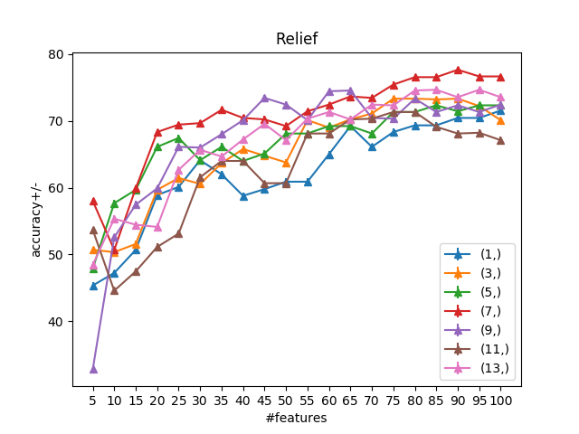

# HYPO_RFS

HYPO_RFS is an exhaustive grid-search Ranking Feature Selection (RFS) approach for hyperparameter optimization. If you don't have any background on feature selection, please refer to the following [source](https://machinelearningmastery.com/an-introduction-to-feature-selection/).

A class of Feature Selection (FS) algorithm, the so called RFS, outputs certain information (e.g., weight matrix, score vector, etc.) such that is possible to exploit such elements as feature ranking information (e.g., sorting the RFS scores in a descending order such that: the higher the score, the more important the feature is). Some RFS algorithms are: Relief, Fisher, RFS, etc. Here for [more information](http://eprints.kku.edu.sa/170/1/feature_selection_for_classification.pdf) about these algorithms.

As you may know, most of the FS algorithms are ruled by several parameters, which in turn (whether changed) may affect the accuracy of a classification task. Therefore, it is important to tune such parameters in order to find the best combination of them which work better for a certain number of features (e.g., the first 30/500 ranked features).

The approach presented here, uses an exhaustive grid-search combined with a majority vote approach for tuning the hyper-parameters of RFS algorithms.

# Requirements

  - python 2.7
  - numpy
  - sklearn
  - skfeature ([download from here](https://github.com/jundongl/scikit-feature/tree/master/skfeature))
 
 # Usage
 
 Run `hypo_main.py` for a naive example. It provides the best combination for a single parameter.
 
 # Example
 
 In this example we tuned the *k* parameter for the Relief approach.
 

`Output:`  
Hyper-params. comb=(1,) has minimum variance of 0.00549974950617  
Hyper-params. comb=(3,) has minimum variance of 0.00677656790123  
Hyper-params. comb=(5,) has minimum variance of 0.0049215782716  
**Hyper-params. comb=(7,) has minimum variance of 0.00669833320988**  
Hyper-params. comb=(9,) has minimum variance of 0.0123234320988  
Hyper-params. comb=(11,) has minimum variance of 0.00763936925926  
Hyper-params. comb=(13,) has minimum variance of 0.00688333037037  

Applying majority voting...  
Parameters set: (1,) got votes: 0.0  
Parameters set: (3,) got votes: 0.0  
Parameters set: (5,) got votes: 3.0  
**Parameters set: (7,) got votes: 64.0**  
Parameters set: (9,) got votes: 25.0  
Parameters set: (11,) got votes: 0.0  
Parameters set: (13,) got votes: 8.0

Best parameters set found on development set is: (7,)  

 # Authors

  Davide Nardone
  
  https://www.linkedin.com/in/davide-nardone-127428102/
  
# Contacts

For any kind of problem, questions, ideas or suggestions, please don't esitate to contact me at: 
- **davide.nardone@live.it**
 
